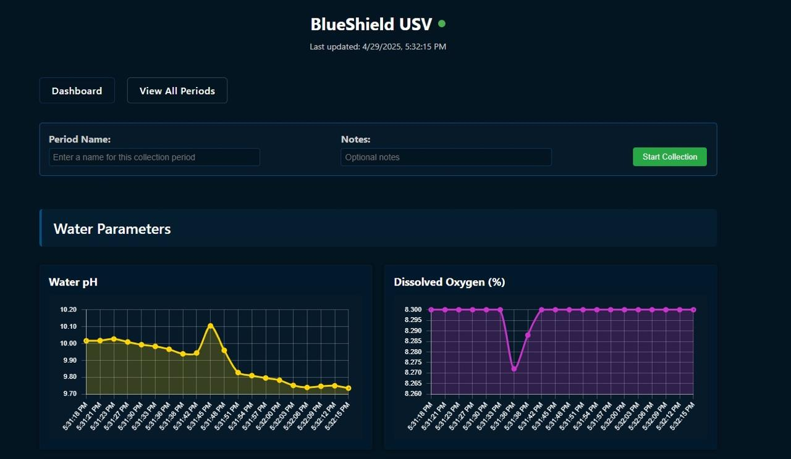
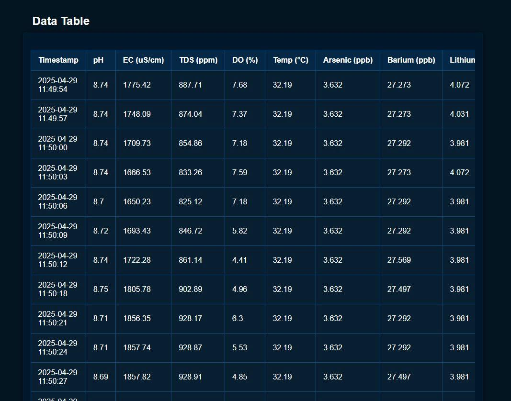
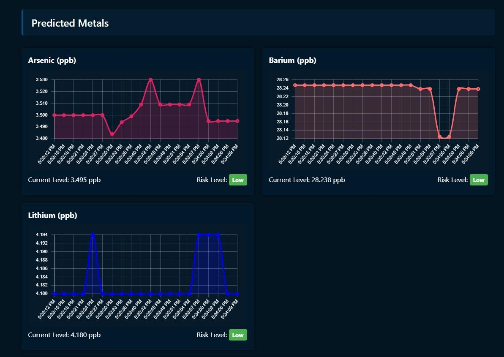
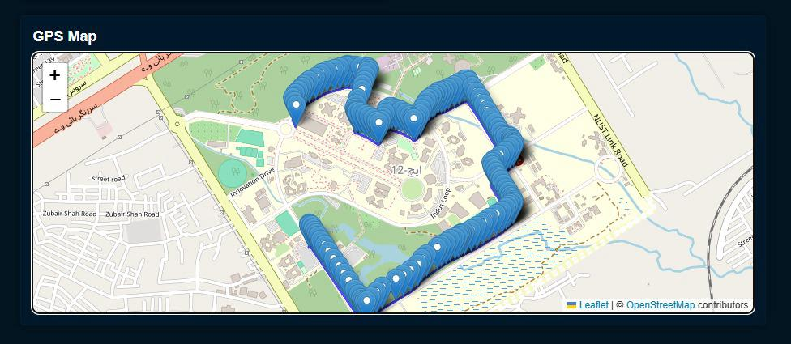
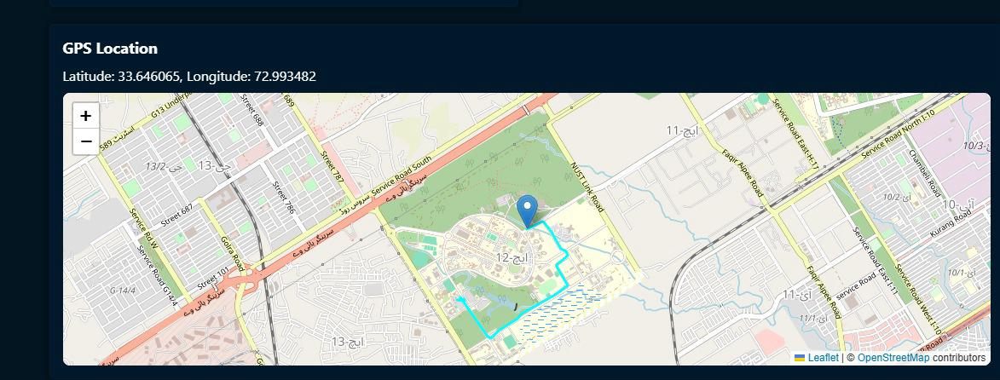

# 🌊 Water Quality Dashboard — Real-Time Monitoring & Heavy Metal Prediction

This is the **web-based monitoring system** for the **BlueShield-USV** project — a smart unmanned surface vehicle designed to assess water quality and predict the presence of harmful **heavy metals** such as **Arsenic, Barium, and Lithium** using real-time sensor data and machine learning.

The dashboard provides a user-friendly interface to:
- 📡 View live water parameter readings
- 🧠 See AI-predicted metal concentrations
- 📍 Track the drone’s real-time GPS location
- 🕒 Analyze historical water quality trends

---

## 🚀 Features

✅ Real-time updates from on-field drone sensors  
✅ REST API integration with the hardware receiver (ESP32 + LoRa)  
✅ ML-based prediction of heavy metal concentrations  
✅ Dynamic dashboard with data tables, graphs, and maps  
✅ Interactive map with drone location tracking (via GPS)

---

## 🧠 Technologies Used

| Component          | Stack/Tool                             |
|--------------------|----------------------------------------|
| Backend            | Python, Flask                          |
| Frontend           | HTML, CSS, JavaScript, Jinja2          |
| Charts             | Chart.js                               |
| Maps               | Leaflet.js                             |
| Communication      | REST API                               |
| ML Models          | Random Forest (trained separately)     |
| Deployment (local) | Flask dev server                       |

---

## Data Flow Overview
ESP32 (receiver side)
      ->
LoRa Data Reception
      ->
Flask API 
      ->
Dashboard Display + ML Prediction

---

## Sensors & Parameters Used
The following sensor values are sent from the drone via LoRa and processed in this web portal:
- pH
- Total Dissolved Solids(TDS)
- Dissolved Oxygen(DO)
- Temperature
  
These are used as features for ML-based prediction of:
- Arsenic
- Barium
- Lithium

## 🖥️ Screenshots
### 🌐 Dashboard UI




### 📍 GPS Tracking Map



## 🛠️ Setup Instructions

Follow the steps below to run the dashboard locally:

### 1. Clone the Repository

```bash
git clone https://github.com/azzan02/Water-Quality-Dashboard.git
cd Water-Quality-Dashboard

```
### 2. (Optional) Create and Activate a Virtual Environment
For Windows:
```bash
python -m venv venv
venv\Scripts\activate
```
